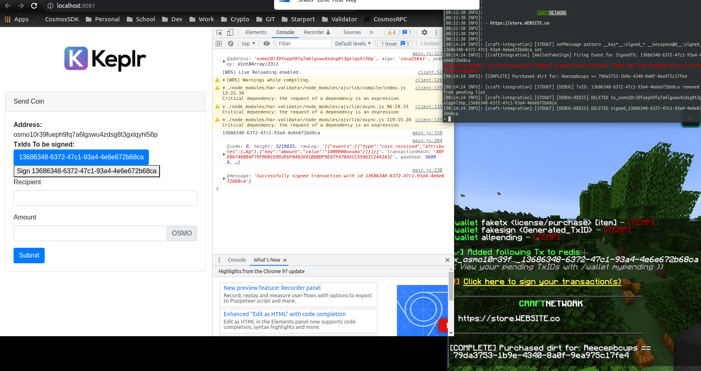
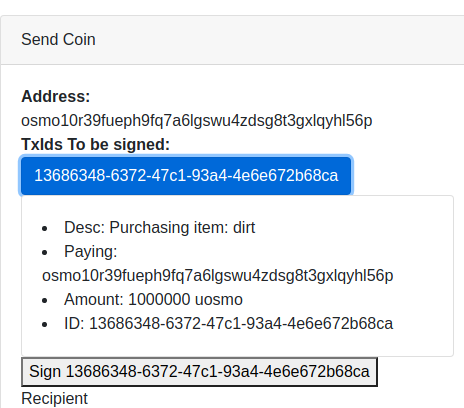

Testing webapp to show TxID idea

Required redis endpoint to be running since keplr is front endpoint

Keplr webapp: *(8081), Osmosis RPCs*
> npm start dev

REST api

GET https://api.crafteconomy.io/v1/tx/:txid
[json response for message generated in game]

GET https://api.crafteconomy.io/v1/tx/all/:wallet
[array of txids & their values from redis]

POST https://api.crafteconomy.io/tx/sign/:txid
[removes key from redis, miecraft will remove key once a server has that TxUUID]

Ensure redis is running & has key events enabled !!!

Ensure redis-cli -> `CONFIG SET notify-keyspace-events K$` (KEA also works)
notify-keyspace-events = "KEA" in `sudo nano /etc/redis/redis.conf`
service restart redis-cli

